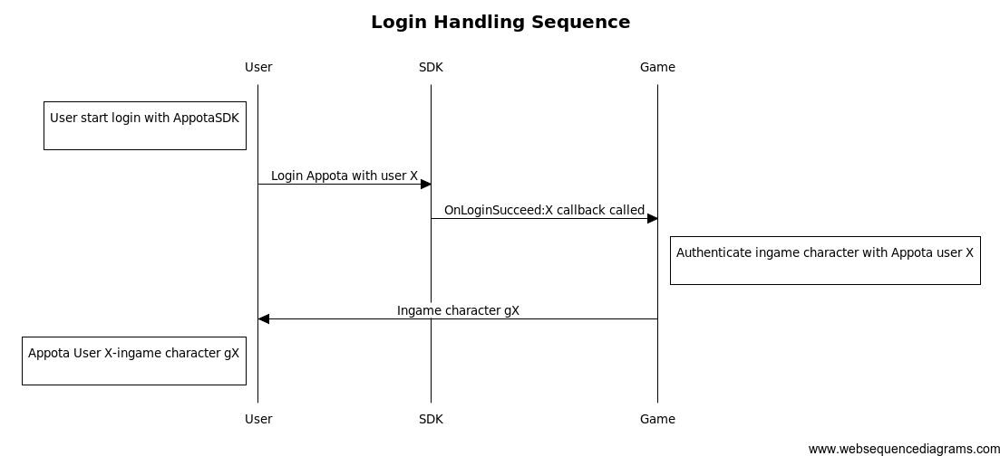
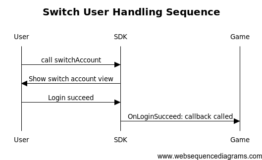

#Version 4 of the Appta Game SDK for Unity

<b> Version 4 of the Appota Game for Unity has been published in this reposity and in Developer Preview. Version 3 will continue to be available in our [appota-ios-game-sdk3](https://github.com/appota/unity-game-sdk3) repository. If you upgrade from SDK3 to SDK4 please check our [Upgrade Document](Upgrade.md) </b>   


##Highlights

* **Appota Login** – Support multiple login methods Appota, Google, Facebook, Twitter, Guest.
* **Appota Payment** – Support mutiple payment methos SMS, Card, E-Bank, Apple Payment.
* **Appota Analytics** – A service for collecting, visualizing, and understanding user and app data (session, active, error log, ...) at scale. 
* **Push Notification** on multiple platforms (iOS, Android, WP).

## Overview
1. [Integrate SDK](#head1-integrate-sdk)
2. [Client API](#head1-client-api)
    * [Init and setup SDK](#head2-init-sdk)
    * [User function](#head2-user-function)
    * [Payment function](#head2-payment-function)
    * [Analytic function](#head2-analytic-function)
    * [Push notification function](#head2-push-notification-function)
3. [Class document](#head1-class-document)
4. [FAQ and Glossary](#head1-faq)

##1. Integrate SDK <a name = "head1-integrate-sdk"> </a>
The [sample apps](AppotaGameUnitySDK4/) are standalone projects that are already set up for you. You can also integrate the SDK for Unity with an existing application.

###1.1. Prerequisites <a name = "head2-prerequisites">  </a>
To get started with the Appota Game SDK for Unity, you can set up the SDK and start building a new project, or you can integrate the SDK in an existing project. You can also run the samples to get a sense of how the SDK works.

Required Unity 4.5 or later

###1.2. Obtain app api key and client key <a name="head2-obtain-app-api-key-and-client-key"> </a>
* Retreive Appota app information `ClientKey`, `APIKey`, `ClientSecret` from app dashboard. <a name="head3-appota-appid"> </a> If you haven't already registered your app with Appota by creating a Appota app, you should [create a new app](https://developer.appota.com/manage-content.html) then retreive app information from developer dashboard.  
* Retreive Facebook Application ID.   <a name="head3-facebook-appid"> </a>  
[Detail about how to create ,retreive and setup Facebook app info for iOS](https://developers.facebook.com/docs/ios/getting-started). If you can not access Facebook Developer page, please contact our support (sale@appota.com) to get the application id.  
* Retreive Google Client ID and Client Secret. <a name="head3-google-appid"> </a>   
Create new project from [https://console.developers.google.com](https://console.developers.google.com), in `API & Auth-Credentials` add iOS support and get ClientID and ClientSecret. If you can not access Google Developer page, please contact our support (sale@appota.com) to get the application id and secret.


###1.3. Configure your Unity Project <a name="head2-configure-your-xcode-project"> </a>

####1.3.1. Import plugin


####1.3.2. Configure Unity project

- Use `FacebookAppID`, `ApiKey`, `GoogleClientID`, `GoogleClientSecret` has created in [IntegrateSDK](#head1-integrate-sdk) to update setting


##2. Client API <a name="head1-client-api"> </a>

###2.1 Init and setup SDK <a name = "head2-init-sdk"> </a>
Related class and function:  
[AppotaSDKHandler](class-document/UnityClasses.html#init-function)  
[AppotaSDKReceiver](class-document/UnityClasses.html#appota-sdk-receiver)    
Appota SDK init must be called once when application start via [AppotaSDKHandler](class-document/UnityClasses.html#init-function) class call `AppotaSDKHandler.Instance.Init()` so most of the time it will be called in your first scene

```
AppotaSDKHandler.Instance.Init();
```

There are some functions to control SDK flows:

- `SetKeepLoginSession(BOOL)` <a name="set-keep-login-session"> </a> this function will control the Appota Login Session will be kept or removed at app lauching (when session's removed user has to login again when app start).   
**Note** If this function is not called, login session will be kept by default.
- `SetAutoShowLogin(BOOL)` <a name="set-auto-show-login-dialog"> </a> this function will control the Appota Login View will be automatically show at app lauching (when user's not logged in) or you have to call [ShowLoginView](#show-login-view) function to show the LoginView.   
**Note** If this function is not called, login view will automatically show at app lauching (when user's not logged in)

- `SetSDKButtonVisible(BOOL)` call this function to setting hide or show SDK floating button

- `FinishSDK()` call this function in `OnApplicationQuit` script
###2.2. User function <a name="head2-user-function"> </a>
Related class and function:

- [AppotaSDKHandler](class-document/UnityClasses.html#user-function)
- [AppotaSDKReceiver](class-document/UnityClasses.html#user-callback)
- [AppotaSession](class-document/UnityClasses.html#appota-session)

Once you've implemented init SDK function, start using login features.

####2.2.1. Show login view <a name = "head2-show-login-view"> </a>
As mentioned above login dialog flow can be control by function [SetAutoShowLoginDialog(BOOL)](#set-auto-show-login-dialog). Automatically show login view at app launching or manual call `ShowLoginView` when you need:  

- **Show Login View**

```
AppotaSDKHandler.Instance.ShowLoginView();

```
<a name="show-login-view"> </a>
Appota Login Dialog contains 5 authorization methods: **Facebook**, **Google**, **Twitter**, **Appota User** and **Quick Login**  


Follow this mechanism for login function, please implement [`didLoginSuccess`](#did-login-succeed) callback to authenticate your in-game user.



- **Logout function**
 
```
AppotaSDKHandler.Instance.Logout();
```

- **Switch account function**

Call this function when user logged in will show a login view and allow to login other account. When switch account succeed `OnLoginSucceed` callback will be called again, so please logout your game account and reauthenticate with new switched account.

```
AppotaSDKHandler.Instance.SwitchAccount();
```




- **Show User Info function**

This function will show user profile view  

```
AppotaSDKHandler.Instance.ShowUserInfo();

```
- **Check user login**
This function will return user logged in state

```
AppotaSDKHandler.Instance.IsUserLogin();
```

- **Get AppotaSession**
Return AppotaSession if logged in

```
AppotaSDKHandler.Instance.GetAppotaSession();
```

- **Set Character**
Set character function to support character management on web

```
public void SetCharacter(string name, string server, string characterID)
```
####2.2.2. Handle authenticaiton callbacks <a name = "login-handle-login-response"> </a>

AppotaSDK provide 4 callbacks delegate for login defined in [`AppotaSDKReceiver`](class-document/UnityClasses.html#appota-sdk-receiver) , please implement these functions to handle login result

----
**Login succeed callback**  
Retreive Appota user info from `AppotaSession` then post to your server to verify and create game user. For more detail about user integration on server: [User Integration](https://github.com/appota/ios-game-sdk/wiki/Integrate-user-system)  

**Note** Remember verify Appota UserID, UserName and Access token on your server before procceeding game user integration

```
public void  OnLoginSucceed(string appotaSession)

```
|Parameter|Description|  
|-------|-----------|  
|appotaSession|`appotaSession` is a json string included all user info, convert the string to AppotaSession ot easily retrevie user information (`AppotaSession.Appota_AccessToken`, `AppotaSession.Appota_UserName`) |

----
**Login fail callback**  
Callback when login have problems

```
public void  OnLoginError(string error);

```

----
**Logout callback**  
Callback after user logout with user name, please logout your game account and call `showLoginView` to login other account

```
public void  OnLogoutSuccess(string userName)

```

----
**Close login view callback**  
Callback when user close login view at app launching

```
public void  OnCloseLoginView();
```

###2.2. Payment function <a name="head2-payment-function"> </a>

Related class and function:

- [AppotaSDKHandler - payment function](class-document/UnityClasses.html#payment-function)
- [AppotaSDKReceiver](class-document/UnityClasses.html#payment-callback)
- [AppotaPaymentResult](class-document/UnityClasses.html#appota-payment-result)

Because using AppotaSDK payment function you should understand Appota Payment mechanism and configuration. Please study Appota payment mechanism at [Appota Payment Document](https://github.com/appota/ios-game-sdk/wiki/Passive-Confirmation-via-IPN) and payment configuration at [Appota Developer Portal]().

####2.2.1. Show payment view <a name="head3-show-payment-view"> </a>

---------
You have 3 methods to show payment view. Each payment view represents one or list of payment package. Each package contains information of game coin amount or in-game package.

**Show default list payment view**

You can show payment view with default list payment packages (which is configured on [Appota Developer Portal]())

```
AppotaSDKHandler.Instance.MakePayment()
```


----
**Show payment view for a specific package**

You can show a specific package depends on your in-game mechanism

```
AppotaGameSDK.Instance.MakePayment(string packageID)
```


----
**Show payment view from SDK floating button**  
User can open Payment, Information and Transaction History view via floating button

(Show image of floating button and then SDK show gif)


####2.2.2 Handle payment callback <a name="head3-handle-payment-callback"> </a>

---------
You have to implement and modified all callbacks in `AppotaSDKReceiver`.

**Callback after a successful payment**

Depends on your payment machenism (IPN, please readmore about [Appota Payment](https://github.com/appota/ios-game-sdk/wiki/Integrate-payment-system)), proceed payment verification or alert payment succeed for user

```
public void OnPaymentSuccess(string transactionResult);
```

|Parameter|Description|  
|-------|-----------|  
|`transactionResult`|`transactionResult` is is a json string included all payment  info (amount, game currency, package id), convert the string to `AppotaPaymentResult` ot easily retrevie payment information|

----
**Callback for payment state**

** YOU HAVE TO IMPLEMENT THIS FUNCTION TO ENSURE GOLD CHARING CORRECTLY **  
**PAYMENT_STATE** is required for our SDK to make correct payment with package. Depends on your payment package implement this function and return a correct payment state.  
For example packageID: `com.gold.package1` - (defined in integration process) corresponds with a package of 1000 gold and current game user is X in server Y. Then payment state can be constructed : com.gold.package1_1000_gold_X_Y (depends on your format).

```
public void GetPaymentState(string packageID);

```
|Parameter|Description|  
|-------|-----------|  
|`packageID`|`packageID` is id of the package has been bought, `packageID` is defined during payment configuration process|

###2.3. Analytic function <a name="head2-analytic-function"> </a>

Appota SDK support calling track for view and event. These track information is very use for game advertisement and tracking.

** View tracking function **  
When enter a view send view for tracking

```
public void SendView(string name);
```

** Event tracking function **  
When user perform an event send event for tracking

```
public void SendEvent(string category,string action,string label)
```
Define `category`, `action`, `label` detail of the action

###2.3. Push notification function <a name="head3-push-notification-function"> </a>
** Register push notification with groupname **  
Register push notification (currenly only support iOS). Use group name to choose user group for easy pushing (for example only push user in server 1 then groupName = "server 1").

```
public void setPushGroup(string groupName)
```

##3. Class Document <a name="head1-class-document"> </a>
- [AppotaSDKHandler](class-document/UnityClasses.html#init-function)
- [AppotaSDKReceiver](class-document/UnityClasses.html#appota-sdk-receiver)
- [AppotaSession](class-document/UnityClasses.html#appota-session)
- [AppotaPaymentResult](class-document/UnityClasses.html#appota-payment-result)

##4. FAQ and Glossary <a name="head1-faq"></a>
- `IPN` is payment machenism used by Appota System to increase gold for game user. Detail in https://github.com/appota/ios-game-sdk/wiki/Passive-Confirmation-via-IPN
- `PackageID` each payment package in game should be defined along with a package ID (provided by SDKTool) to identify package.
- `PaymentState` payment state must be implemented in `GetPaymentState` function. And use `PackageID` and game server information to build up `PaymentState`.   
For example packageID: `com.gold.package1` - (defined in integration process) corresponds with a package of 1000 gold and current game user is X in server Y. Then payment state can be constructed : com.gold.package1_1000_gold_X_Y (depends on your format).
