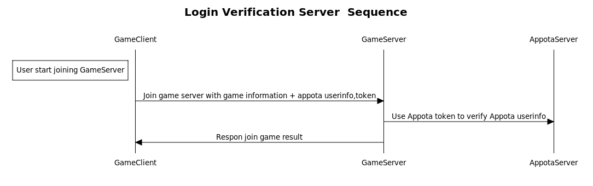

AppotaSDK - Server connection sample
=====
## 1. Login sample
After login successful on client and join game, you should call Appota Server to verify user information to prevent hacking and impersonation.


Sample of login verification by PHP:
[login_game.php](login_game.php)

```
// Verify user with Appota User API
function verify_appota_user($appota_access_token, $appota_userid, $appota_username) {
    $url = sprintf('https://api.appota.com/game/get_user_info?access_token=%s', $appota_access_token);
    $data = call_curl_get($url, null);
    if(!$data['status'])
        return false;
    else {
        if($data["data"]["username"] == $appota_username & $data["data"]["user_id"] == $appota_userid)
            return true;
        else
            return false;
    }    
}

```

## 2. Payment sample
After payment successful, payment will follow this flow to increase gold


Sample of these is in [ipn.php](ipn.php)